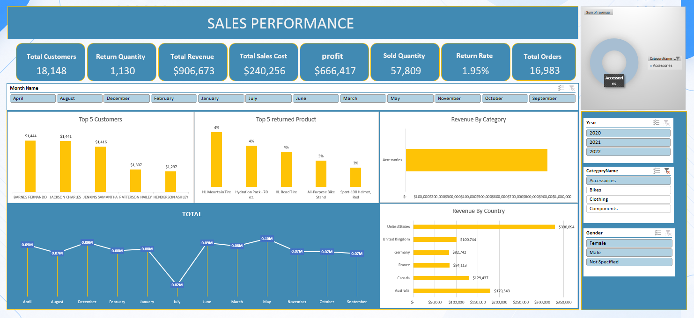

# Sales Performance Dashboard

## Project Overview

An interactive Sales Performance Dashboard developed using Microsoft Excel to analyze sales performance and provide clear business insights through data visualization.

## Tools & Techniques

* Microsoft Excel
* Pivot Tables
* Pivot Charts
* Slicers
* Data Cleaning
* Data Analysis
* Dashboard Design

## Dashboard

## Project Objectives

* Analyze overall sales performance
* Identify sales trends and patterns
* Compare performance across different categories
* Use interactive slicers to explore the data
* Present key findings through an easy-to-understand dashboard

## Key Insights

The dashboard provides an interactive view of sales performance, allowing users to identify trends, compare different segments, and monitor key performance indicators.

## Project Files

* `Sales Performance Dashboard.xlsx` — Excel dashboard and analysis
* `dashboard.png` — Dashboard preview
